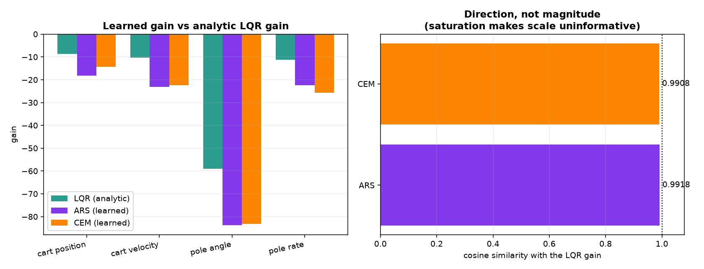
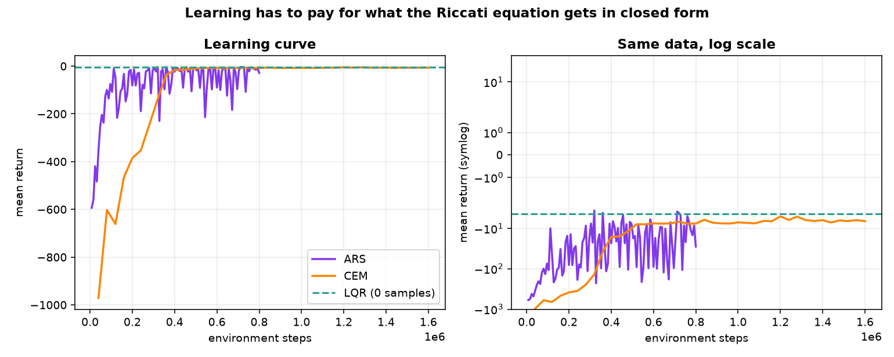
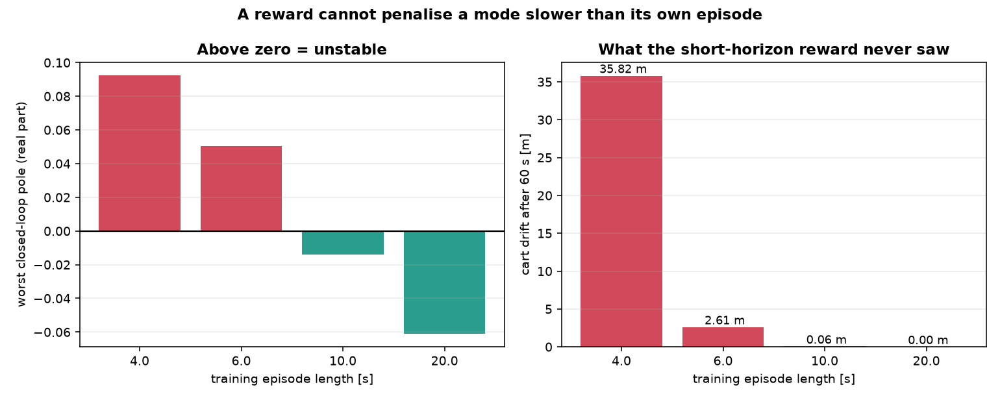

# Inverted Pendulum Control Lab

A cart-pole simulator that pits **PID**, **LQR**, **MPC**, an **energy-shaping swing-up** controller
and two **learned policies** against each other on the same plant, the same actuator limit, the same
scenarios and the same objective, and scores them with objective metrics.

Everything is derived and implemented from scratch in NumPy: the equations of motion, the analytic
linearisation, the matrix exponential, both Riccati solvers, the MPC quadratic program and the
reinforcement learning. **Neither SciPy nor PyTorch is a dependency** — none of the mathematics is
hidden behind a library call.

[](https://github.com/yongjunmun/Inverted-Pendulum/actions/workflows/ci.yml)
[](https://www.python.org/)
[](LICENSE)
[](requirements.txt)


*Starting from hanging straight down, the energy controller pumps the pole up over three swings, and
control is handed to LQR at t = 2.77 s once the state enters the region where the linear design is
provably valid. Balanced by t = 5.12 s, using 1.71 m of a 2.5 m rail.*

---

## Why the cart-pole

It is the smallest system that is simultaneously **unstable**, **underactuated** and **non-minimum
phase**. One control input has to manage two degrees of freedom, the open-loop plant has a pole at
+5.44 rad/s, and to move the cart right you must first move it left. Anything that works here is
doing real control, not gain-guessing.

## Results

Produced by `python -m cartpole.cli bench`, reproduced in CI on every push.
All figures below are regenerated from the committed code.

| Scenario | Controller | Success | Settling [s] | Peak angle [deg] | RMS angle [deg] | Peak force [N] | Effort [N²s] | ITAE |
|---|---|:---:|---:|---:|---:|---:|---:|---:|
| regulation | PID | yes | 2.26 | 11.46 | 1.56 | 8.72 | 9.54 | 0.062 |
| regulation | LQR | yes | 1.97 | 11.46 | 1.77 | 10.00 | 3.04 | 0.055 |
| regulation | MPC | yes | 1.98 | 11.46 | 1.81 | 10.00 | 2.78 | 0.057 |
| disturbance | PID | yes | 3.28 | 8.90 | 1.47 | 10.00 | 20.48 | 0.096 |
| disturbance | LQR | yes | 2.13 | 3.90 | 0.69 | 10.00 | 5.57 | 0.048 |
| disturbance | MPC | yes | 2.32 | 4.25 | 0.78 | 10.00 | 5.40 | 0.055 |
| tracking | PID | yes | 3.11 | 10.30 | 1.81 | 10.00 | 16.91 | 0.199 |
| tracking | LQR | yes | 2.71 | 8.00 | 2.30 | 8.66 | 2.43 | 0.229 |
| tracking | MPC | yes | 2.71 | 7.97 | 2.30 | 7.25 | **2.11** | 0.230 |
| noisy-sensors | PID | yes | 2.37 | 8.59 | 1.13 | 6.29 | 14.55 | 0.109 |
| noisy-sensors | LQR | yes | 2.09 | 8.59 | 1.22 | 8.41 | 8.04 | 0.072 |
| noisy-sensors | MPC | yes | 2.11 | 8.59 | 1.25 | 7.27 | 6.05 | 0.073 |
| swing-up | SwingUp+LQR | yes | 5.12 | 7.83 | 2.52 | 10.00 | 49.18 | 5.356 |

**Scenarios** — `regulation`: recover from an 11.5° tilt. `disturbance`: a 12 N, 50 ms impulse push
while balanced. `tracking`: move the cart 1 m without dropping the pole. `noisy-sensors`: 0.5° angle
noise, 2 mm encoder noise, noisy rates. `swing-up`: start hanging at 180°.


### What the numbers say

**1. All three balance the pole. The difference is what it costs.**
PID spends **3.1× to 7.0×** more control energy than LQR and settles 0.3–1.2 s later. It is not
strictly worse at everything — its RMS *angle* is slightly lower in three scenarios, because the
outer loop clamps the tilt setpoint at 0.20 rad and lets the cart wander instead. That is the trade
it is making, and the effort column is the bill. Look at the force trace above: PID rings at ~12 rad/s
while LQR and MPC apply one smooth corrective pulse. Every one of those oscillations is heat in a
real motor and wear in a real gearbox.

**2. MPC only beats LQR where the actuator limit binds.**
Unsaturated they are nearly identical, which is expected — the terminal cost of the MPC *is* the
Riccati solution. In `tracking`, where the limit is reached, MPC finishes at the same 2.71 s using a
**7.25 N** peak instead of 8.66 N, because the constraint is inside the optimisation rather than a
clip applied afterwards. Buying a smaller motor for the same performance is a real engineering result.

**3. A well-tuned cascade PID is LQR wearing a disguise.**
The optimal gain is `K = [-8.66, -10.33, -59.09, -11.18]`, which factorises exactly into the cascade
structure:

$$u = \underbrace{59.09}_{K_p^{\theta}}\left(\theta - \theta_\text{ref}\right) + \underbrace{11.18}_{K_d^{\theta}}\dot{\theta},
\qquad \theta_\text{ref} = 0.147\,(x_\text{ref} - x) - 0.175\,\dot{x}$$

So LQR *is* an outer position loop feeding tilt setpoints to an inner angle loop — it just derives the
four gains from a cost function instead of trial and error. My hand-tuned PID landed on the same
ratios ($K_d/K_p = 0.175$ against LQR's $0.189$; outer $D/P = 1.3$ against $1.19$). That is the whole
argument for optimal control in one equation.

**4. Model error is what actually kills controllers.**


Every controller is designed once against the nominal model, then made to stabilise 169 plants whose
pole mass and length are wrong by up to 3×. LQR and MPC survive **84.6%** of the grid; PID survives
**55.6%**. The failure boundary is almost vertical: getting the pole **length** wrong is fatal, getting
the **mass** wrong barely matters — mass cancels out of the dominant $\sqrt{g/l}$ time constant. On a
real rig, that says spend your calibration effort on geometry, not on the scale.


## Learning-based control

Run with `python -m cartpole.cli learn`.

Most cart-pole RL projects cannot be compared to classical control, because they use a different
plant, a different reward and a different time step from the baselines they are implicitly beating.
Here the learned policies optimise **exactly the cost the Riccati equation minimises**,
$r_t = -(e^\top Q e + R u^2)\,\mathrm{d}t$, with the same $Q$ and $R$ used to design the LQR — so any
difference is attributable to the *method*, not to the two controllers chasing different goals.

Two derivative-free algorithms are implemented from scratch: **ARS**
(Mania et al. 2018) and the **Cross-Entropy Method**. Both train a *linear* policy $u = w \cdot s$,
which is deliberate: that lives in the same parameter space as the LQR law $u = -Ks$, so the learned
solution can be compared against the analytic one directly rather than only through episode returns.

### Random search rediscovers the LQR gain



| | Score | Cosine similarity vs $K$ | Stabilising | Scenarios | 60 s drift | Samples |
|---|---:|---:|:---:|:---:|---:|---:|
| **LQR** (analytic) | **−4.43** | 1.0000 | yes | 4/4 | 0.000 m | **0** |
| ARS | −4.64 | **0.9918** | yes | 4/4 | 0.000 m | 800,000 |
| CEM | −4.68 | 0.9908 | yes | 4/4 | 0.000 m | 1,600,000 |
| do-nothing | −1014.31 | — | no | 0/4 | — | 0 |

```
ARS learned gain   [-18.15, -23.08, -83.77, -22.40]
LQR analytic gain  [ -8.66, -10.33, -59.09, -11.18]
```

The directions agree to four decimal places; the magnitudes differ by 1.49×. That is expected and is
why **cosine similarity is the honest metric here** — with a saturating actuator a policy can scale
its weights up and behave almost identically, so magnitude carries little information.

The cost of getting there is the point. ARS needed **800,000 environment steps** to approximate what
one Riccati solve produces exactly, in closed form, with a stability certificate attached.



### Capacity: does a neural policy help?

Same algorithm, same budget, same reward. Only the function class changes.

| Policy | Parameters | Score | Scenarios |
|---|---:|---:|:---:|
| Linear | **4** | **−4.64** | **4/4** |
| MLP 16×16 | 369 | −30.72 | 0/4 |

The 369-parameter network is **6.6× worse** and fails every scenario. On a problem whose optimal
solution is provably linear, capacity buys nothing and costs sample efficiency. Reporting this rather
than quietly dropping it is the difference between an experiment and a demo.

### Four things that went wrong first

Every one of these was a real failure that the classical baseline exposed:

**1. Search scale.** Seeded at the conventional $\sigma = 1$, both algorithms returned policies at
**5% of the required gain magnitude** and cosine similarity 0.46. The optimal gain has entries near 59;
probing with unit noise explores essentially nothing. Fixed by scaling the search to the parameters
being searched for.

**2. Elite fraction.** CEM at the textbook 0.2 collapsed its sampling distribution early — cosine 0.77,
**1/4 scenarios**. Keeping half the population instead: cosine 0.99, **4/4**, no other change.

**3. Distribution coverage.** ARS failed the `tracking` scenario outright while passing everything
else. It had been trained with cart offsets up to 0.1 m and was being asked to move 1 m. Widening the
training distribution to 1.5 m fixed it with no change to the algorithm.

**4. Reward sign trap.** Every reward here is negative, so an agent that crashes early accumulates
*less* negative reward and scores *better* than one that survives. Without an explicit failure
penalty, random search reliably learns to crash on purpose. There is a regression test for this.

### The horizon trap

**A reward cannot penalise a mode slower than its own episode.**



| Training episode | Worst closed-loop pole | Unstable time constant | Cart drift over 60 s |
|---:|---:|---:|---:|
| **4.0 s** | **+0.0926** | 10.8 s | **35.82 m** |
| **6.0 s** | **+0.0505** | 19.8 s | **2.61 m** |
| 10.0 s | −0.0139 | stable | 0.06 m |
| 20.0 s | −0.0611 | stable | 0.00 m |

The relationship is monotonic: the longer the episode, the slower the mode the reward can still see.

The 4 s policy scored near-optimal and looked fine. Its closed-loop eigenvalues did not: a pole at
**+0.093**, a 10.8 s time constant, entirely invisible inside a 4 s episode. Over a 60 s run it held
the pole at 1.8° while walking the cart **35.8 metres** off the rail.

No amount of reward-curve inspection catches that. One `eig(A - BK)` call does, instantly. That is
the argument for keeping classical analysis in the loop even when the controller is learned — and it
is why the gain comparison above reports *stabilising: yes/no* alongside the score.

This effect needs a narrow start distribution as well as a short horizon; under the tuned defaults
every episode length converges to a stabilising gain. The study pins both conditions so the horizon is
the only variable.

## The controllers

| | Idea | Where it lives |
|---|---|---|
| **Cascaded PID** | Slow outer loop turns cart-position error into a tilt setpoint; fast inner loop tracks the tilt. Conditional-integration anti-windup, filtered setpoint. | [`controllers/pid.py`](cartpole/controllers/pid.py) |
| **LQR** | Analytic linearisation about upright, continuous-time Riccati equation solved via the stable invariant subspace of the Hamiltonian matrix. | [`controllers/lqr.py`](cartpole/controllers/lqr.py) |
| **MPC** | Zero-order-hold discretisation, cost condensed onto the input sequence, box-constrained QP solved with FISTA, terminal weight from the discrete Riccati equation. Warm-started each step. | [`controllers/mpc.py`](cartpole/controllers/mpc.py) |
| **Swing-up** | Energy shaping with collocated partial feedback linearisation, then an LQR catch gated on the Lyapunov value function $e^\top P e$. | [`controllers/swingup.py`](cartpole/controllers/swingup.py) |
| **ARS / CEM** | Derivative-free reinforcement learning. Augmented Random Search and the Cross-Entropy Method train a linear policy on the negated LQR cost. | [`learning/trainers.py`](cartpole/learning/trainers.py) |

Two details worth pointing at:

- **The swing-up hand-over uses the LQR value function, not an angle threshold.** $e^\top P e$ is a
  Lyapunov function for the linear closed loop, so it answers "will the catch actually succeed?"
  rather than "does the pole look roughly upright?". In the run above it correctly *rejects* a
  19° crossing at t = 1.5 s because the cart was 1.2 m off-centre and still moving.
- **MPC solves in 1.46 ms median (2.73 ms p95) against a 10 ms control period** on a laptop CPU, in
  pure NumPy, for a 30-step horizon. The gradient-projection QP has no external solver dependency and
  satisfies the box constraint exactly at every iteration, so an early exit is still feasible — the
  property you need before putting it on a microcontroller.

## The plant

Uniform-rod pole on a cart, viscous friction on rail and hinge, single horizontal force input.
State $s = [x, \dot{x}, \theta, \dot{\theta}]$ with $\theta$ measured from **upright**.
Derived by Euler-Lagrange, with **no small-angle approximation** in the simulator:

$$\begin{bmatrix} M + m & m l \cos\theta \\\\ m l \cos\theta & J \end{bmatrix}
\begin{bmatrix} \ddot{x} \\\\ \ddot{\theta} \end{bmatrix} =
\begin{bmatrix} u - b_c \dot{x} + m l \sin\theta\, \dot{\theta}^2 \\\\ m g l \sin\theta - b_p \dot{\theta} \end{bmatrix}$$

where $l = L/2$ and $J = m l^2 + mL^2/12$. Integrated with RK4 at 1 kHz while controllers run at
100 Hz through a zero-order hold, which is how an embedded controller actually behaves.

## How it is verified

71 unit tests, run on Python 3.10-3.13 in CI. The interesting ones check the *mathematics*, not just
that the code runs:

| Test | What it proves |
|---|---|
| Analytic vs. finite-difference Jacobian | The hand-derived linearisation is correct — they agree to **1.4 × 10⁻¹¹** across three parameter sets |
| Energy conservation, no damping, no input | RK4 is accurate — energy drifts by **< 10⁻⁸** relative over 5 s |
| Step-size halving | Integrator error falls by > 8×, confirming the expected 4th-order convergence |
| CARE residual $A^\top P + PA - PBR^{-1}B^\top P + Q$ | The Riccati solver is right — residual **1.3 × 10⁻¹²**, and $P \succ 0$ |
| DARE residual + closed-loop spectral radius | Discrete solution is right and the terminal cost is stabilising |
| QP KKT conditions | The MPC solver reaches the true constrained optimum, not just a feasible point |
| MPC commanded force vs. box | Constraints are honoured *by the optimiser*, never by clipping |
| Short horizon (N = 8) still stabilises | The terminal cost, not horizon length, is what buys stability |
| Metrics on synthetic signals | The scoring code cannot flatter a controller |
| CI workflow command vs. the CLI parser | The command in `ci.yml` is parsed by the real argument parser, so the workflow cannot drift out of sync with the code |
| Loading $-K$ into the linear policy reproduces the LQR exactly | The learned and analytic controllers really are the same function class, so comparing them is valid |
| Cosine similarity is scale-invariant | A gain scaled 2.5× still scores 1.0000, confirming the metric measures direction not magnitude |
| An early crash scores worse than surviving | The negative-reward trap that would otherwise teach the agent to crash on purpose |
| Training is reproducible from a seed | Learning results in the table can actually be re-derived |
| Importing `cartpole.learning` without Gymnasium | The core stays dependency-free; the RL library adapter is strictly opt-in |

CI additionally re-runs the whole benchmark and fails the build if any of the 13 runs stops
stabilising, so the results table can never silently go stale.

## Quick start

```bash
git clone https://github.com/yongjunmun/Inverted-Pendulum.git
cd Inverted-Pendulum
pip install -r requirements.txt

python run.py                         # simplest: open run.py in an editor and press Run

python -m cartpole.cli bench          # scenario suite, plots, results table
python -m cartpole.cli robustness     # 169-plant mismatch sweep (~3 min)
python -m cartpole.cli animate        # swing-up GIF
python -m cartpole.cli learn          # train ARS/CEM, compare to the LQR gain (~5 min)
python -m cartpole.cli all            # all of the above into results/

python -m unittest discover -s tests -t . -v
```

Designing your own controller takes one class:

```python
import numpy as np
from cartpole import CartPoleParams
from cartpole.controllers import Controller
from cartpole.metrics import evaluate
from cartpole.simulate import simulate

class BangBang(Controller):
    name = "BangBang"

    def compute(self, state, time, reference):
        return -10.0 * np.sign(state[2] + 0.3 * state[3])

params = CartPoleParams()
result = simulate(BangBang(), params, initial_state=np.array([0.0, 0.0, 0.2, 0.0]))
print(evaluate(result))
```

## Layout

```
run.py                click-to-run entry point
cartpole/
  dynamics.py         equations of motion, energy, analytic + numeric linearisation
  linalg.py           expm, ZOH discretisation, CARE, DARE, box-constrained QP
  simulate.py         zero-order-hold closed loop, sensor noise, disturbances
  metrics.py          settling time, overshoot, effort, ITAE, success criteria
  scenarios.py        the five benchmark scenarios
  experiments.py      benchmark sweep and robustness study
  plotting.py         time histories, phase portraits, effort bars, robustness maps
  animate.py          GIF export
  cli.py              command line entry point
  controllers/        pid.py, lqr.py, mpc.py, swingup.py, learned.py
  learning/           policies, ARS + CEM trainers, gain analysis, optional Gymnasium env
tests/                71 unit tests
results/              committed figures and benchmark.csv
```

## Limitations

Stated plainly, because a simulation result is not a hardware result:

- **No hardware validation.** The plant is a model. Real rigs add backlash, belt stretch, stiction,
  encoder quantisation, and motor dynamics that a pure force input ignores.
- **Full state feedback.** Cart velocity and pole rate are assumed measurable. A real rig differentiates
  encoder counts and needs an observer; there is no Kalman filter here.
- **MPC is linear.** It predicts with the upright linearisation, so it is a balancing controller only.
  It cannot swing up, and it would degrade at large angles where the linearisation stops holding.
- **The noise model is white Gaussian.** No bias, drift, dropouts or latency.
- **The robustness study varies two parameters.** Friction, actuator dynamics and delay are held at
  nominal, so 84.6% is an optimistic figure, not a certificate.
- **The learned policies are linear and trained only about upright.** They cannot swing up, and
  nothing here claims deep RL would not do better on a harder task — only that on *this* task, whose
  optimal solution is linear, a 369-parameter network was measurably worse.
- **Learning is trained on a coarser model than it is scored on.** Training integrates at 50 Hz for
  speed; every reported number comes from re-scoring on the full 1 kHz simulator, but the policies
  never saw that fidelity during training.
- **No sim-to-real transfer is claimed.** The learned policies were not domain-randomised, so they
  would be expected to degrade on the mismatch grid the classical controllers were tested against.

## Next steps

Luenberger observer and Kalman filter for output feedback, nonlinear MPC over the true dynamics,
a friction-and-delay term to shrink the robustness gap honestly, domain-randomised training so the
learned policies can be scored on the same mismatch grid as the classical ones, and a
hardware-in-the-loop harness so the same controller code can drive a real rig.

## License

[MIT](LICENSE) - free to use, modify and distribute, with attribution and no warranty.
