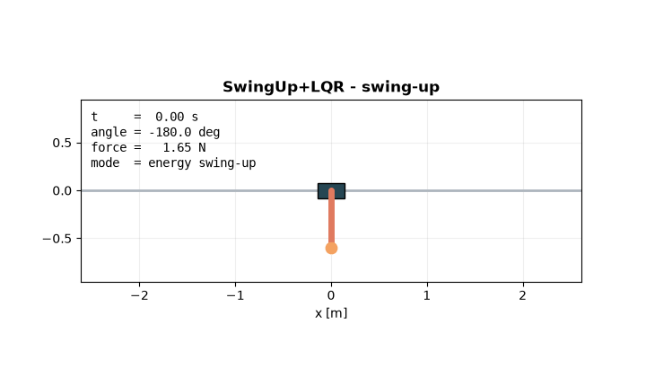
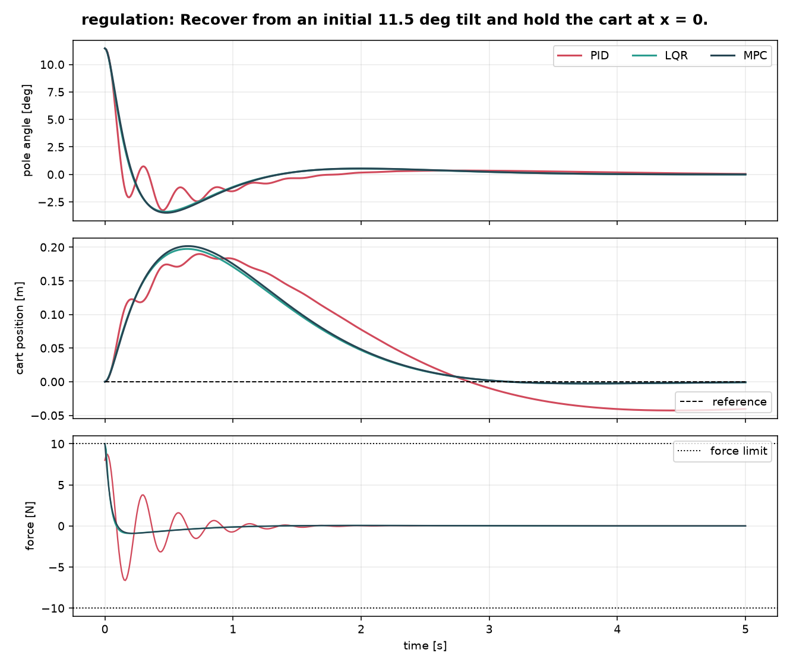
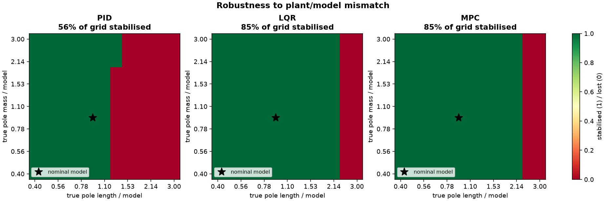
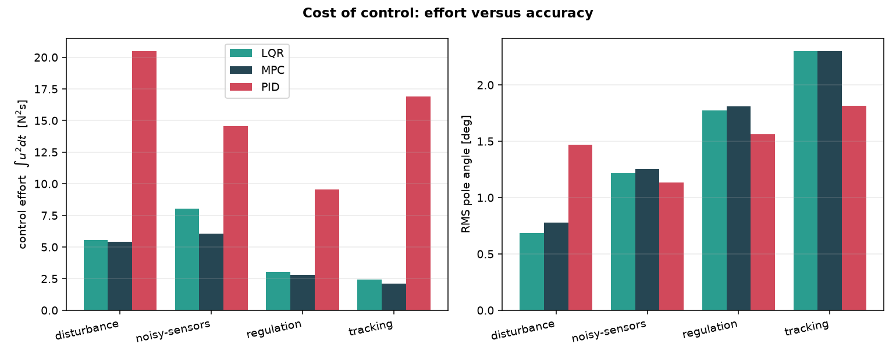

# Inverted Pendulum Control Lab

A cart-pole simulator that pits **PID**, **LQR**, **MPC** and an **energy-shaping swing-up** controller
against each other on the same plant, the same actuator limit and the same scenarios, and scores them
with objective metrics.

Everything is derived and implemented from scratch in NumPy: the equations of motion, the analytic
linearisation, the matrix exponential, both Riccati solvers and the MPC quadratic program. **SciPy is
not a dependency** — none of the control mathematics is hidden behind a library call.

[](https://github.com/JunMun-Yong_GHIFX/inverted-pendulum-control-lab/actions/workflows/ci.yml)
[](https://www.python.org/)
[](LICENSE)
[](requirements.txt)



*Starting from hanging straight down, the energy controller pumps the pole up over three swings, and
control is handed to LQR at t = 2.77 s once the state enters the region where the linear design is
provably valid. Balanced by t = 5.12 s, using 1.71 m of a 2.5 m rail.*

---

## Why the cart-pole

It is the smallest system that is simultaneously **unstable**, **underactuated** and **non-minimum
phase**. One control input has to manage two degrees of freedom, the open-loop plant has a pole at
+5.44 rad/s, and to move the cart right you must first move it left. Anything that works here is
doing real control, not gain-guessing.

## Results

Produced by `python -m cartpole.cli bench`, reproduced in CI on every push.
All figures below are regenerated from the committed code.

| Scenario | Controller | Success | Settling [s] | Peak angle [deg] | RMS angle [deg] | Peak force [N] | Effort [N²s] | ITAE |
|---|---|:---:|---:|---:|---:|---:|---:|---:|
| regulation | PID | yes | 2.26 | 11.46 | 1.56 | 8.72 | 9.54 | 0.062 |
| regulation | LQR | yes | 1.97 | 11.46 | 1.77 | 10.00 | 3.04 | 0.055 |
| regulation | MPC | yes | 1.98 | 11.46 | 1.81 | 10.00 | 2.78 | 0.057 |
| disturbance | PID | yes | 3.28 | 8.90 | 1.47 | 10.00 | 20.48 | 0.096 |
| disturbance | LQR | yes | 2.13 | 3.90 | 0.69 | 10.00 | 5.57 | 0.048 |
| disturbance | MPC | yes | 2.32 | 4.25 | 0.78 | 10.00 | 5.40 | 0.055 |
| tracking | PID | yes | 3.11 | 10.30 | 1.81 | 10.00 | 16.91 | 0.199 |
| tracking | LQR | yes | 2.71 | 8.00 | 2.30 | 8.66 | 2.43 | 0.229 |
| tracking | MPC | yes | 2.71 | 7.97 | 2.30 | 7.25 | **2.11** | 0.230 |
| noisy-sensors | PID | yes | 2.37 | 8.59 | 1.13 | 6.29 | 14.55 | 0.109 |
| noisy-sensors | LQR | yes | 2.09 | 8.59 | 1.22 | 8.41 | 8.04 | 0.072 |
| noisy-sensors | MPC | yes | 2.11 | 8.59 | 1.25 | 7.27 | 6.05 | 0.073 |
| swing-up | SwingUp+LQR | yes | 5.12 | 7.83 | 2.52 | 10.00 | 49.18 | 5.356 |

**Scenarios** — `regulation`: recover from an 11.5° tilt. `disturbance`: a 12 N, 50 ms impulse push
while balanced. `tracking`: move the cart 1 m without dropping the pole. `noisy-sensors`: 0.5° angle
noise, 2 mm encoder noise, noisy rates. `swing-up`: start hanging at 180°.



### What the numbers say

**1. All three balance the pole. The difference is what it costs.**
PID spends **3.1× to 7.0×** more control energy than LQR and settles 0.3–1.2 s later. It is not
strictly worse at everything — its RMS *angle* is slightly lower in three scenarios, because the
outer loop clamps the tilt setpoint at 0.20 rad and lets the cart wander instead. That is the trade
it is making, and the effort column is the bill. Look at the force trace above: PID rings at ~12 rad/s
while LQR and MPC apply one smooth corrective pulse. Every one of those oscillations is heat in a
real motor and wear in a real gearbox.

**2. MPC only beats LQR where the actuator limit binds.**
Unsaturated they are nearly identical, which is expected — the terminal cost of the MPC *is* the
Riccati solution. In `tracking`, where the limit is reached, MPC finishes at the same 2.71 s using a
**7.25 N** peak instead of 8.66 N, because the constraint is inside the optimisation rather than a
clip applied afterwards. Buying a smaller motor for the same performance is a real engineering result.

**3. A well-tuned cascade PID is LQR wearing a disguise.**
The optimal gain is `K = [-8.66, -10.33, -59.09, -11.18]`, which factorises exactly into the cascade
structure:

$$u = \underbrace{59.09}_{K_p^{\theta}}\left(\theta - \theta_\text{ref}\right) + \underbrace{11.18}_{K_d^{\theta}}\dot{\theta},
\qquad \theta_\text{ref} = 0.147\,(x_\text{ref} - x) - 0.175\,\dot{x}$$

So LQR *is* an outer position loop feeding tilt setpoints to an inner angle loop — it just derives the
four gains from a cost function instead of trial and error. My hand-tuned PID landed on the same
ratios ($K_d/K_p = 0.175$ against LQR's $0.189$; outer $D/P = 1.3$ against $1.19$). That is the whole
argument for optimal control in one equation.

**4. Model error is what actually kills controllers.**



Every controller is designed once against the nominal model, then made to stabilise 169 plants whose
pole mass and length are wrong by up to 3×. LQR and MPC survive **84.6%** of the grid; PID survives
**55.6%**. The failure boundary is almost vertical: getting the pole **length** wrong is fatal, getting
the **mass** wrong barely matters — mass cancels out of the dominant $\sqrt{g/l}$ time constant. On a
real rig, that says spend your calibration effort on geometry, not on the scale.



## The controllers

| | Idea | Where it lives |
|---|---|---|
| **Cascaded PID** | Slow outer loop turns cart-position error into a tilt setpoint; fast inner loop tracks the tilt. Conditional-integration anti-windup, filtered setpoint. | [`controllers/pid.py`](cartpole/controllers/pid.py) |
| **LQR** | Analytic linearisation about upright, continuous-time Riccati equation solved via the stable invariant subspace of the Hamiltonian matrix. | [`controllers/lqr.py`](cartpole/controllers/lqr.py) |
| **MPC** | Zero-order-hold discretisation, cost condensed onto the input sequence, box-constrained QP solved with FISTA, terminal weight from the discrete Riccati equation. Warm-started each step. | [`controllers/mpc.py`](cartpole/controllers/mpc.py) |
| **Swing-up** | Energy shaping with collocated partial feedback linearisation, then an LQR catch gated on the Lyapunov value function $e^\top P e$. | [`controllers/swingup.py`](cartpole/controllers/swingup.py) |

Two details worth pointing at:

- **The swing-up hand-over uses the LQR value function, not an angle threshold.** $e^\top P e$ is a
  Lyapunov function for the linear closed loop, so it answers "will the catch actually succeed?"
  rather than "does the pole look roughly upright?". In the run above it correctly *rejects* a
  19° crossing at t = 1.5 s because the cart was 1.2 m off-centre and still moving.
- **MPC solves in 1.46 ms median (2.73 ms p95) against a 10 ms control period** on a laptop CPU, in
  pure NumPy, for a 30-step horizon. The gradient-projection QP has no external solver dependency and
  satisfies the box constraint exactly at every iteration, so an early exit is still feasible — the
  property you need before putting it on a microcontroller.

## The plant

Uniform-rod pole on a cart, viscous friction on rail and hinge, single horizontal force input.
State $s = [x, \dot{x}, \theta, \dot{\theta}]$ with $\theta$ measured from **upright**.
Derived by Euler-Lagrange, with **no small-angle approximation** in the simulator:

$$\begin{bmatrix} M + m & m l \cos\theta \\\\ m l \cos\theta & J \end{bmatrix}
\begin{bmatrix} \ddot{x} \\\\ \ddot{\theta} \end{bmatrix} =
\begin{bmatrix} u - b_c \dot{x} + m l \sin\theta\, \dot{\theta}^2 \\\\ m g l \sin\theta - b_p \dot{\theta} \end{bmatrix}$$

where $l = L/2$ and $J = m l^2 + mL^2/12$. Integrated with RK4 at 1 kHz while controllers run at
100 Hz through a zero-order hold, which is how an embedded controller actually behaves.

## How it is verified

45 unit tests, run on Python 3.10–3.13 in CI. The interesting ones check the *mathematics*, not just
that the code runs:

| Test | What it proves |
|---|---|
| Analytic vs. finite-difference Jacobian | The hand-derived linearisation is correct — they agree to **1.4 × 10⁻¹¹** across three parameter sets |
| Energy conservation, no damping, no input | RK4 is accurate — energy drifts by **< 10⁻⁸** relative over 5 s |
| Step-size halving | Integrator error falls by > 8×, confirming the expected 4th-order convergence |
| CARE residual $A^\top P + PA - PBR^{-1}B^\top P + Q$ | The Riccati solver is right — residual **1.3 × 10⁻¹²**, and $P \succ 0$ |
| DARE residual + closed-loop spectral radius | Discrete solution is right and the terminal cost is stabilising |
| QP KKT conditions | The MPC solver reaches the true constrained optimum, not just a feasible point |
| MPC commanded force vs. box | Constraints are honoured *by the optimiser*, never by clipping |
| Short horizon (N = 8) still stabilises | The terminal cost, not horizon length, is what buys stability |
| Metrics on synthetic signals | The scoring code cannot flatter a controller |

CI additionally re-runs the whole benchmark and fails the build if any of the 13 runs stops
stabilising, so the results table can never silently go stale.

## Quick start

```bash
git clone https://github.com/JunMun-Yong_GHIFX/inverted-pendulum-control-lab.git
cd inverted-pendulum-control-lab
pip install -r requirements.txt

python -m cartpole.cli bench          # scenario suite, plots, results table
python -m cartpole.cli robustness     # 169-plant mismatch sweep (~3 min)
python -m cartpole.cli animate        # swing-up GIF
python -m cartpole.cli all            # all of the above into results/

python -m unittest discover -s tests -t . -v
```

Designing your own controller takes one class:

```python
import numpy as np
from cartpole import CartPoleParams
from cartpole.controllers import Controller
from cartpole.metrics import evaluate
from cartpole.simulate import simulate

class BangBang(Controller):
    name = "BangBang"

    def compute(self, state, time, reference):
        return -10.0 * np.sign(state[2] + 0.3 * state[3])

params = CartPoleParams()
result = simulate(BangBang(), params, initial_state=np.array([0.0, 0.0, 0.2, 0.0]))
print(evaluate(result))
```

## Layout

```
cartpole/
  dynamics.py         equations of motion, energy, analytic + numeric linearisation
  linalg.py           expm, ZOH discretisation, CARE, DARE, box-constrained QP
  simulate.py         zero-order-hold closed loop, sensor noise, disturbances
  metrics.py          settling time, overshoot, effort, ITAE, success criteria
  scenarios.py        the five benchmark scenarios
  experiments.py      benchmark sweep and robustness study
  plotting.py         time histories, phase portraits, effort bars, robustness maps
  animate.py          GIF export
  cli.py              command line entry point
  controllers/        pid.py, lqr.py, mpc.py, swingup.py
tests/                45 unit tests
results/              committed figures and benchmark.csv
```

## Limitations

Stated plainly, because a simulation result is not a hardware result:

- **No hardware validation.** The plant is a model. Real rigs add backlash, belt stretch, stiction,
  encoder quantisation, and motor dynamics that a pure force input ignores.
- **Full state feedback.** Cart velocity and pole rate are assumed measurable. A real rig differentiates
  encoder counts and needs an observer; there is no Kalman filter here.
- **MPC is linear.** It predicts with the upright linearisation, so it is a balancing controller only.
  It cannot swing up, and it would degrade at large angles where the linearisation stops holding.
- **The noise model is white Gaussian.** No bias, drift, dropouts or latency.
- **The robustness study varies two parameters.** Friction, actuator dynamics and delay are held at
  nominal, so 84.6% is an optimistic figure, not a certificate.

## Next steps

Luenberger observer and Kalman filter for output feedback, nonlinear MPC over the true dynamics,
a friction-and-delay term to shrink the robustness gap honestly, and a hardware-in-the-loop harness
so the same controller code can drive a real rig.

## License

[MIT](LICENSE) - free to use, modify and distribute, with attribution and no warranty.
